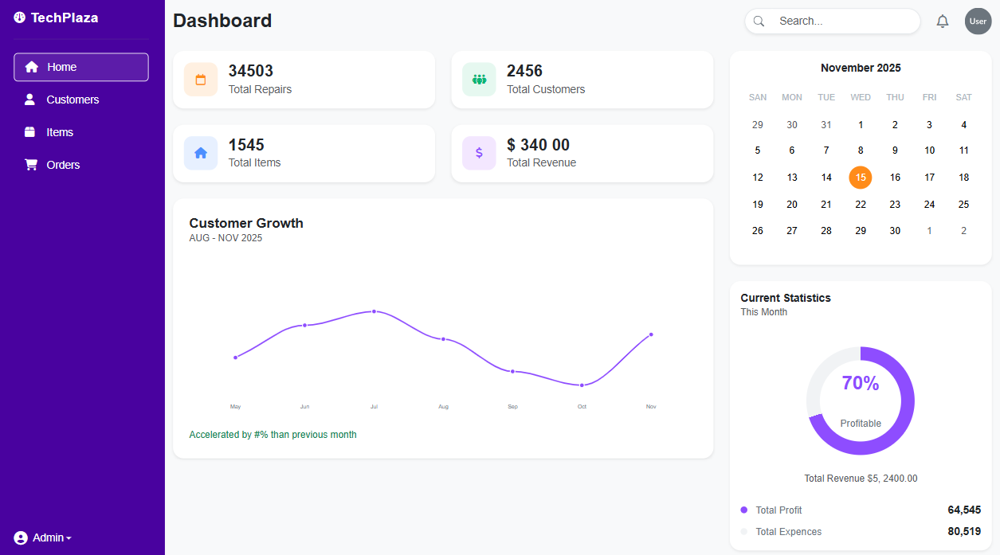
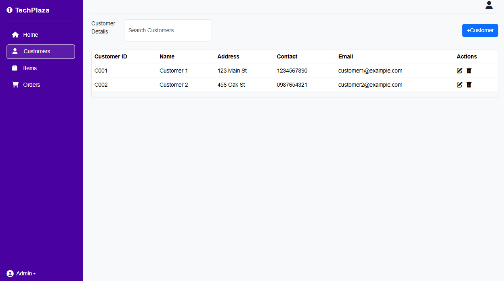
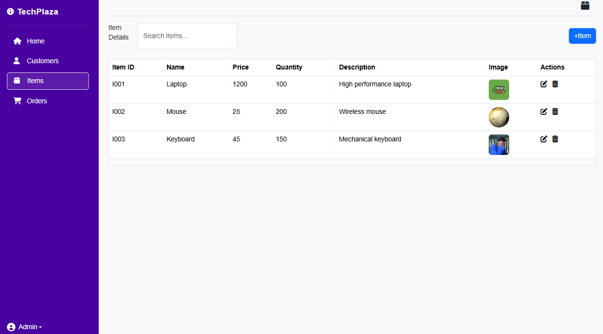
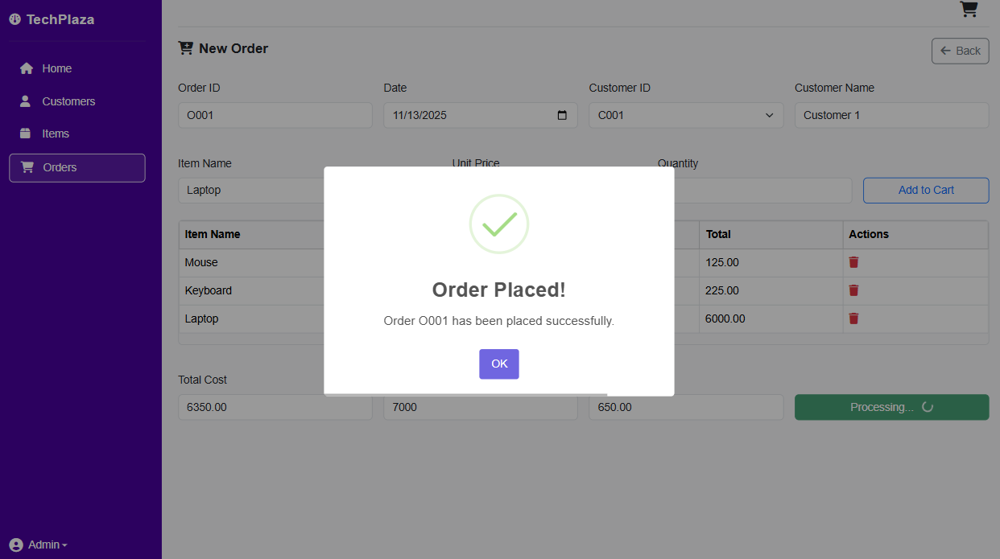
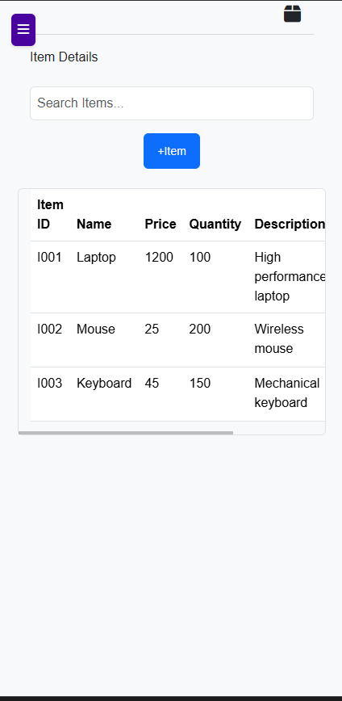

# TechPlaza POS System

A modern, web-based Point of Sale (POS) system designed for retail businesses. TechPlaza POS provides an intuitive interface for managing customers, items, and orders with real-time processing capabilities.

## 🌟 Features

- **Customer Management**: Add, edit, and manage customer information
- **Item Management**: Track inventory, prices, and product details
- **Order Processing**: Create and manage sales orders
- **Responsive Design**: Works seamlessly on desktop and mobile devices
- **Modern UI**: Clean and intuitive interface using Bootstrap 5

## 🛠️ Technology Stack

- **Frontend**: HTML5, CSS3, Bootstrap 5, Font Awesome, JavaScript, JQuery
- **UI Components**: Sweet Alert 2 for notifications
- **Architecture**: MVC pattern with DTOs

## 📁 Project Structure

```
TechPlaza-POS/
├── assets/
│   ├── css/
│   │   └── styles.css          # Main stylesheet
│   └── js/
│       └── modalManager.js     # Modal functionality
├── controller/
│   ├── customerController.js   # Customer operations
│   ├── itemController.js       # Item management
│   └── orderController.js      # Order processing
├── db/
│   └── DB.js                   # Database configuration
├── dto/
│   ├── customerDTO.js         # Customer data transfer objects
│   ├── itemDTO.js             # Item data transfer objects
│   └── orderDTO.js            # Order data transfer objects
├── model/
│   ├── customerModel.js        # Customer data models
│   ├── itemModel.js           # Item data models
│   └── orderModel.js          # Order data models
├── index.html                 # Main application entry point
└── README.md                  # Project documentation
```

## 🚀 Getting Started

### Prerequisites

- Modern web browser (Chrome, Firefox, Safari, Edge)
- Local web server (recommended for development)
- Node.js (for backend functionality)

### Installation

1. Clone or download the project files
2. Navigate to the project directory
3. Open `index.html` in your web browser

### Usage

1. **Dashboard**: Access the main dashboard after loading the application
2. **Customer Management**: Navigate to customer section to add/edit customers
3. **Item Management**: Manage your inventory through the items section
4. **Order Processing**: Create new orders and process sales
5. **Mobile Support**: Use the hamburger menu on mobile devices

## 📸 Screenshots


### Main Dashboard


### Customer Management


### Item Management


### Order Processing


### Mobile View


## 🔧 Configuration

The system uses a modular architecture with separate controllers for different functionalities:

- **Customer Controller**: Handles all customer-related operations
- **Item Controller**: Manages inventory and product information
- **Order Controller**: Processes sales and order management

Database configuration can be found in `db/DB.js`

## 🎯 Key Components

### Modal Manager
Located in `assets/js/modalManager.js`, provides reusable modal functionality for the entire application.

### Data Transfer Objects (DTOs)
Standardized data structures for consistent data handling across the application.

### Models
Data models that define the structure for customers, items, and orders.

## 📱 Mobile Responsiveness

The application is fully responsive with:
- Collapsible sidebar for mobile devices
- Touch-friendly interface elements
- Optimized layouts for different screen sizes
- Mobile-specific navigation controls

## 🔒 Security Features

- Input validation on all forms
- Secure data handling practices

## 📝 License

This project is part of educational coursework and is intended for learning purposes.


---

